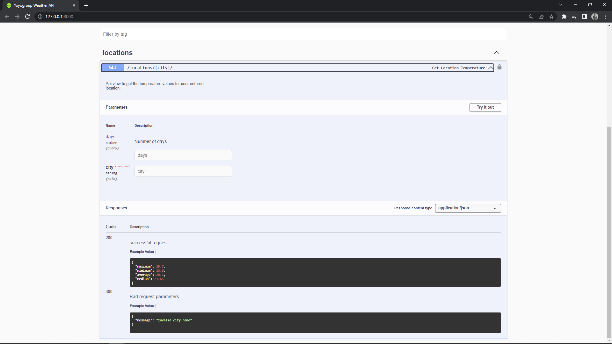
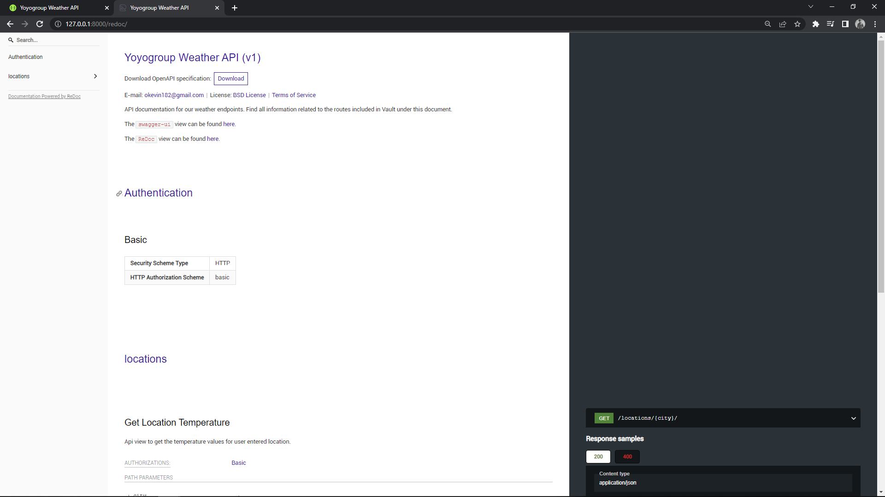

## Yoyo Group Weather API
[](https://github.com/Kevin-Ravasco/weather-api/actions/workflows/django.yml) 

This project is the implementation for the interview project which addresses
the following requirements:
- Create a Django application with RESTful API
- Django application must run locally
- API must be in the format /api/locations/{city}/?days={number_of_days}
- API must fetch weather data from some public API of your choice
- API must compute min, max, average, and median temperature
- Response format must be in the following structure:
```    
{
    maximum: value,
    minimum: value,
    average: value,
    median: value,
}
```

#### Major Requirements / Technologies used
- Python >=3.5
- Django 3.2.9
- Djangorestframework 3.14.0
- Swagger UI documentation

### Notes

The project has assumed a free public api approach (no authentication needed) in order to interact
with the endpoints.

The external api chosen weather api endpoint is [Weather Api](https://www.weatherapi.com/).
To use this api, an api key needs to be used which has been included in `example.env`

Note: I understand the security risk of putting API keys on public repo, but for easy running of
the project it has been included and will be changed after 2 weeks

The project has only one endpoint which returns the maximum, minimum, average and
median temperatures for the user given city and days. Check the documentation.

No models and serializers have been created since we are doing the fetch from an
external api and no need for db/serializer operations


## Running The Project
Create a `.env` file in the project root.
Copy the contents of `.example.env` into your `.env` file.


Create a virtual environment to install dependencies in and activate it:

```sh
$ pip install virtualenv
$ virtualenv venv
$ venv/bin/activate or venv\\Scripts\\activate 
```

Then install the dependencies:

```sh
(venv)$ pip install -r requirements.txt
```
Note the `(venv)` in front of the prompt. This indicates that this terminal
session operates in a virtual environment.

Create a file called `.env` and copy the contents of the `example.env` into your
created `.env` file.

Once `pip` has finished downloading the dependencies:
```sh
(venv)$ python manage.py migrate
(venv)$ python manage.py runserver
```


## Project Structure.
The project structure has been kept as simple as possible and assumes the following
pattern

```tree
weather-api/            <- project root
├── core/               <- Django root (created by django-admin startproject command)
│   ├── __init__.py
│   ├── settings/
│   │   ├── __init__.py
│   │   ├── development.py
│   │   ├── base.py 
│   │   └── production.py
│   ├── urls.py
│   └── wsgi.py
├── apps/
│   └── __init__.py
├── docs/
├── manage.py
├── README.md
├── .env
├── .example.env
├── .gitignore
└──  requirements.txt
```

## API Documentation
The documentation for the api endpoints has been done using [swagger ui](https://swagger.io/tools/swagger-ui/)
and redoc. The documentation can be found in the root path `/` and redoc in `/redoc`.




## Testing
Tests for the project have been written and are in `tests` module in the `api` app.

To run the tests run the following command:
```shell
coverage run manage.py test
```

Generate the coverage report by running:
```shell
coverage html
```

Generate an updated coverage badge:
```shell
coverage-badge -o docs/coverage.svg
```


